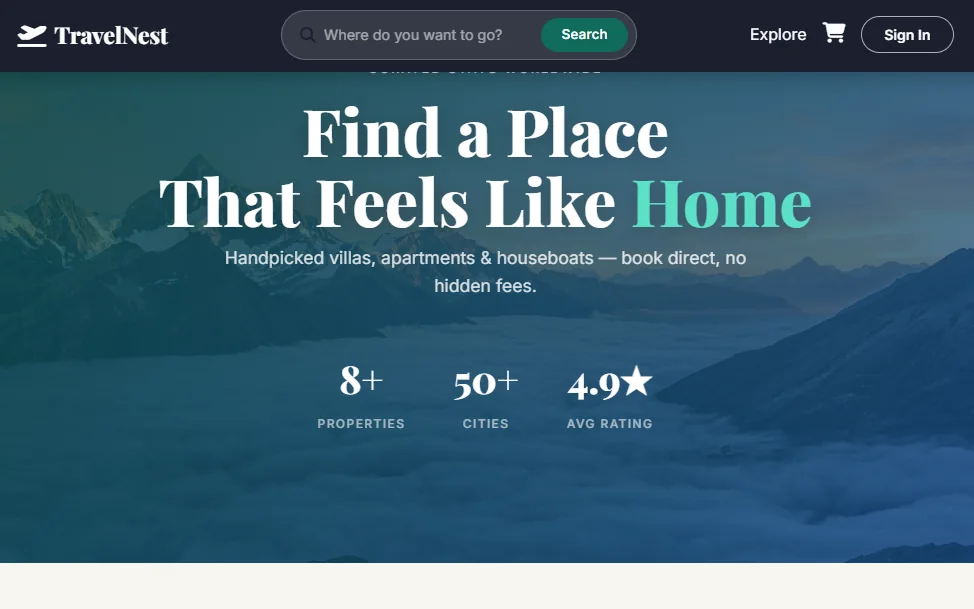
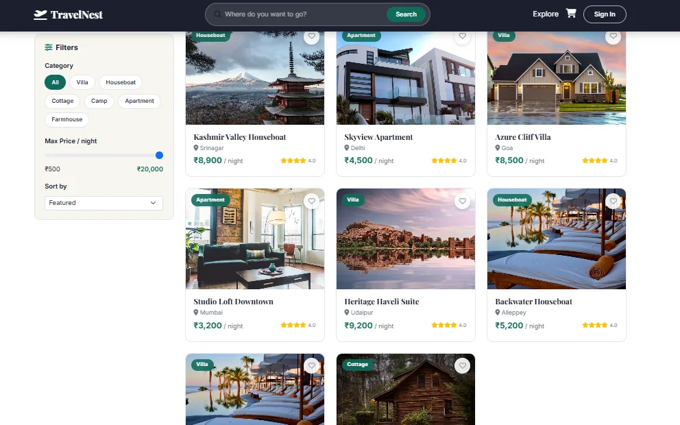
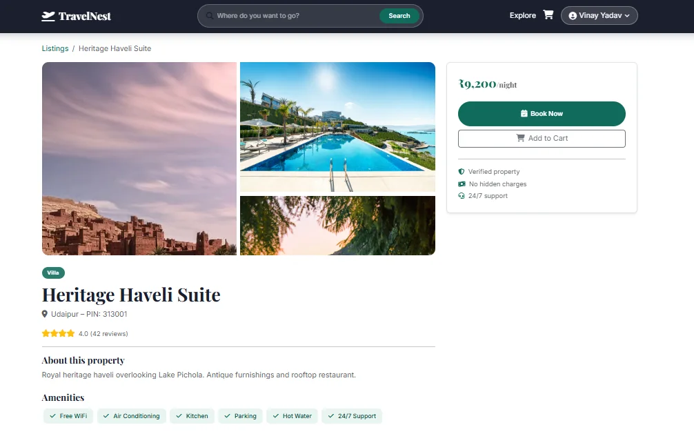
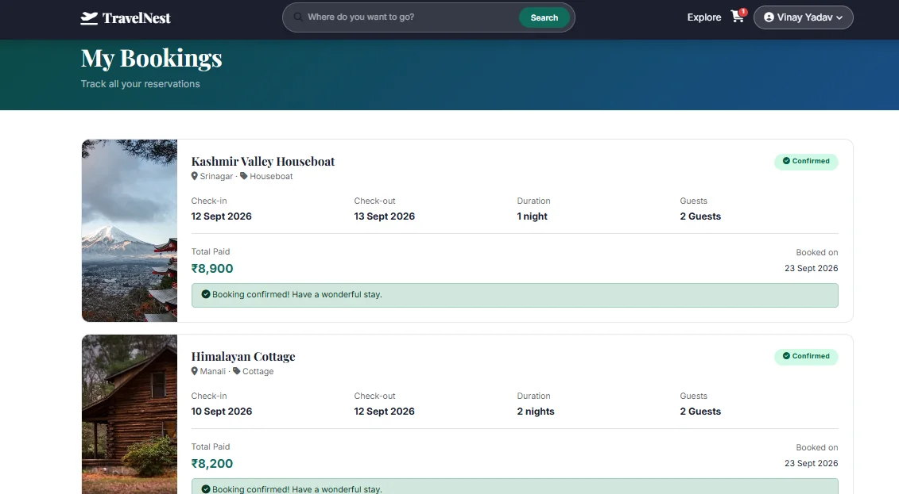

# TravelNest - Travel Stay Booking Website

This is my TravelNest project, a travel stay booking website made with React.
In this website user can search places like villas, houseboats, cottages and camps, see details, add to cart and book a stay. Bookings are approved or rejected by admin from the TravelNest admin panel.

**Live Link:** https://travelnest-user.vercel.app

**Admin Panel:** https://travelnest-admin.vercel.app ([code](https://github.com/VinayYadav07/travelnest-admin))



## Features

- Home page with search bar, search result opens on Listings page
- Filter places by category and max price
- Sort places by Featured, Price Low to High, Price High to Low and Name A-Z
- Place detail page with photos, price and amenities
- Wishlist (heart button) saved in localStorage
- Add places to cart, cart is saved in localStorage
- Sign up and login using Firebase Authentication (REST API)
- Booking form checks dates, name, address, 10 digit mobile number and number of guests
- Number of nights and total price are calculated automatically
- My Bookings page shows status: Pending Approval, Confirmed or Rejected
- My Bookings page opens only after login
- Bookings and listings are saved in Firebase Realtime Database using fetch
- Sample places show if database is empty

## Tech Used

- React.js
- JavaScript
- Vite
- React Router
- Bootstrap
- Firebase Authentication (REST API)
- Firebase Realtime Database (REST API)
- Fetch API
- CSS

## Screenshots

| Listings | Place Details | My Bookings |
|---|---|---|
|  |  |  |

## What I Learned

- How to make search, filter and sort together in React
- How to send search value from one page to another using URL (search params)
- How to calculate nights and total price from dates
- How to check form values before saving (validation)
- How user website and admin panel can work with the same database

## Problems I Faced

- After deploying on Vercel, page was showing 404 on refresh. I added `vercel.json` to fix React Router routing.
- Check-out date could be before check-in date. I added a check and error message.
- User could open My Bookings without login. I made a protected route, so it goes to login page.

## Future Plans

- Add online payment
- Add reviews and ratings from users
- Save wishlist in Firebase so it works on any device

## How to Run

1. Clone the project

```bash
git clone https://github.com/VinayYadav07/travelnest-user.git
cd travelnest-user
```

2. Install packages

```bash
npm install
```

3. Make a `.env` file in the main folder and add your Firebase key

```
VITE_FIREBASE_KEY=your_firebase_api_key
```

4. Start the project

```bash
npm run dev
```

5. Open http://localhost:5173 in browser

## Made By

**Vinay Kumar Yadav**

- Portfolio: https://portfolio-rho-red-54.vercel.app
- LinkedIn: https://www.linkedin.com/in/vinay-yadav-593b53329
- GitHub: https://github.com/VinayYadav07
